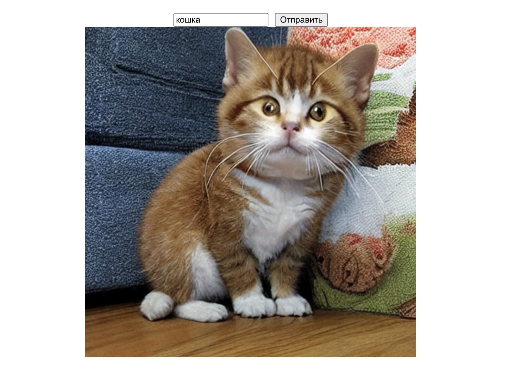
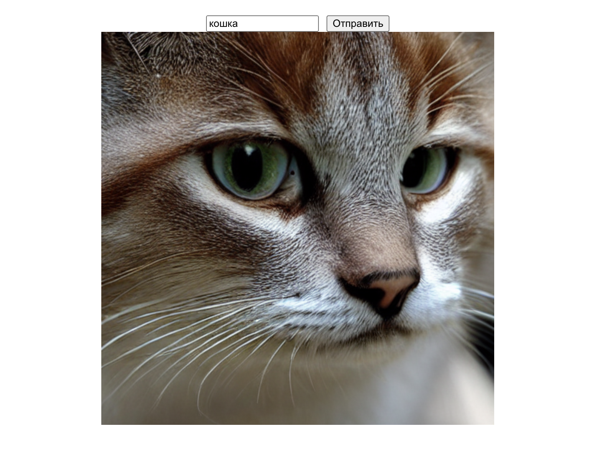
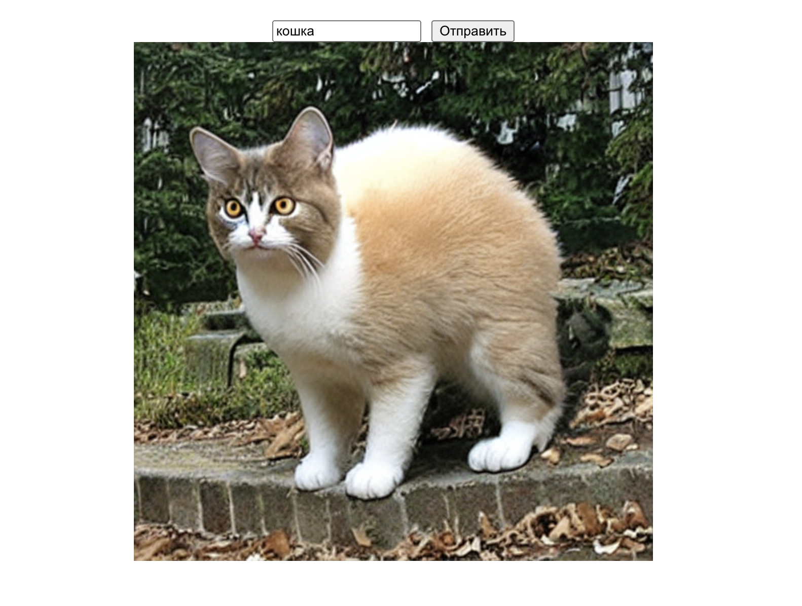

# unstableDiffusion

## Как запустить

### Подготовка 

Подготовка всех зависимостей 

```bash
# для сервера
cd server
python -m venv .venv
source .venv/bin/activate
pip install -r requirements.txt

# для клиента
cd client
yarn install
```
### Запуск

```bash
# для сервера
cd server
source .venv/bin/activate
python main.py

# для клиента
cd client
yarn start
```

## Временные результаты
  


